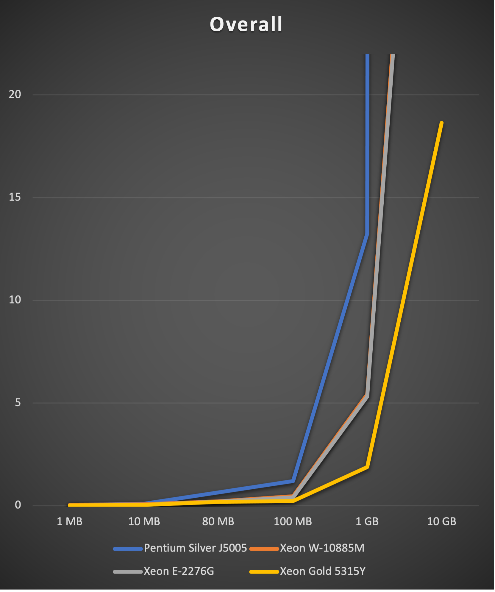
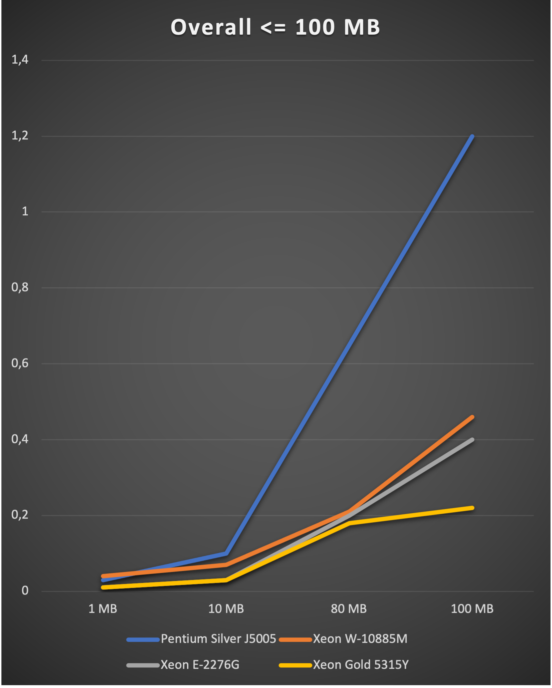
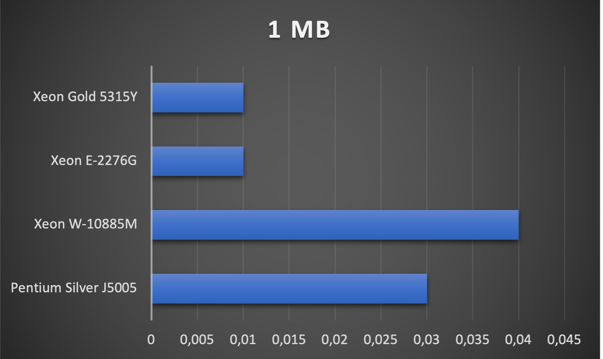
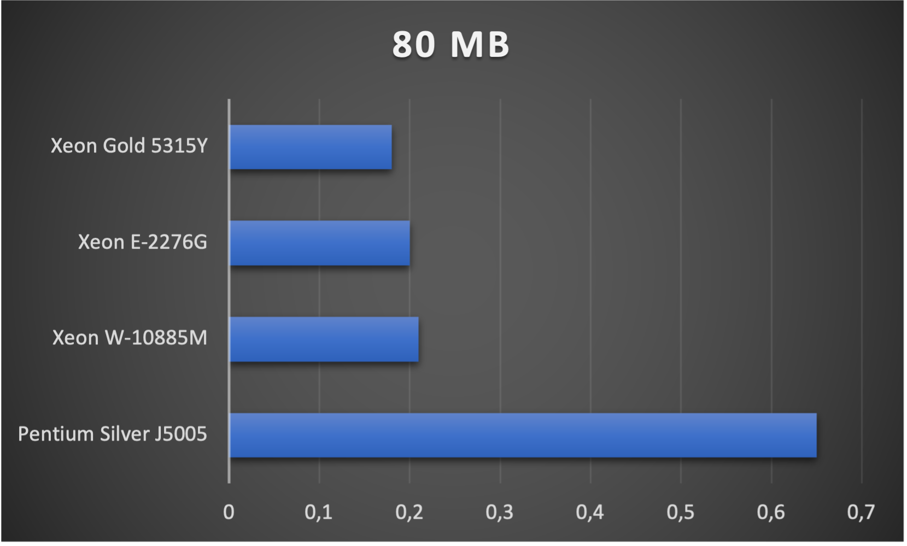
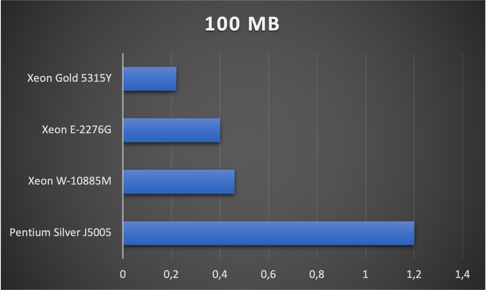

# SGX Benchmark
Intel SGX Benchmark.

## Systems
Find all detailed information from [dmidecode](https://www.nongnu.org/dmidecode/) and [test-sgx](https://github.com/ayeks/SGX-hardware) under **system** folder.

### Intel NUC7PJYH (SGX1 & SGX2)
- Pentium Silver J5005 CPU @ 1.50 GHz, 8 GB RAM @ 2400 MT/s
- Ubuntu 20.04.3, Intel DCAP driver 1.41, PSW 2.15.1
- EPC section in Processor Reserved Memory, 94 MB

### Dell Precision 5750 (SGX1)
- Xeon W-10885M CPU @ 2.40 GHz, 64 GB ECC RAM @ 2667 MT/s
- Ubuntu 22.04, Kernel 5.13, PSW 2.15.1
- EPC section in Processor Reserved Memory, 93 MB

### HP ProLiant DL20 Gen10 (SGX1)
- Xeon E-2276G CPU @ 3.80 GHz, 32 GB ECC RAM @ 2667 MT/s
- Red Hat Enterprise Linux 8.5, Intel DCAP driver 1.41, PSW 2.13
- EPC section in Processor Reserved Memory, 93 MB

### SuperMicro X12SPM-TF (SGX1 & SGX2)
- Xeon Gold 5315Y CPU @ 3.20 GHz, 512 GB ECC RAM @ 2933 MT/s
- Ubuntu 20.04.3, Intel DCAP driver 1.41, PSW 2.15.1
- EPC section in Processor Reserved Memory, 65144 MB

## Benchmarks
Benchmarks are time-based. The tests run 1.000 times, and the average is used for this document. The tests run in release hardware mode without mitigation of CVE-2020-0551.

Find the complete running data inside **data** folder and the code inside **code** folder.

### Enclave Size
Run different sized enclaves by 1,000 iterations.

##### Overall

##### 1 MB Enclave
- Xeon Gold 5315Y: 0,01 seconds.
- Xeon E-2276G: 0,01 seconds.
- Xeon W-10885M: 0,04 seconds.
- Pentium Silver J5005: 0,03 seconds.

**Less is better.**

##### 10 MB Enclave
- Xeon Gold 5315Y: 0,03 seconds.
- Xeon E-2276G: 0,03 seconds.
- Xeon W-10885M: 0,07 seconds.
- Pentium Silver J5005: 0,1 seconds.

**Less is better.**

##### 80 MB Enclave
Inside SGX1 processor available memory. So this is mostly the last value, which will not swap EPC pages.

- Xeon Gold 5315Y: 0,18 seconds.
- Xeon E-2276G: 0,2 seconds.
- Xeon W-10885M: 0,21 seconds.
- Pentium Silver J5005: 0,65 seconds.

**Less is better.**

##### 100 MB Enclaves
- Xeon Gold 5315Y: 0,22 seconds.
- Xeon E-2276G: 0,4 seconds.
- Xeon W-10885M: 0,46 seconds.
- Pentium Silver J5005: 1,2 seconds.

**Less is better.**

##### 1 GB Enclaves
- Xeon Gold 5315Y: 1,88 seconds.
- Xeon E-2276G: 5,31 seconds.
- Xeon W-10885M: 5,42 seconds.
- Pentium Silver J5005: 13,25 seconds.

**Less is better.**

##### 10 GB Enclaves
- Xeon Gold 5315Y: 18,64 seconds.
- Xeon E-2276G: 53,6 seconds.
- Xeon W-10885M: 54,67 seconds.
- Pentium Silver J5005: Not enough memory. But will swap to disk and will execute in about 57 minutes.

**Less is better.**
